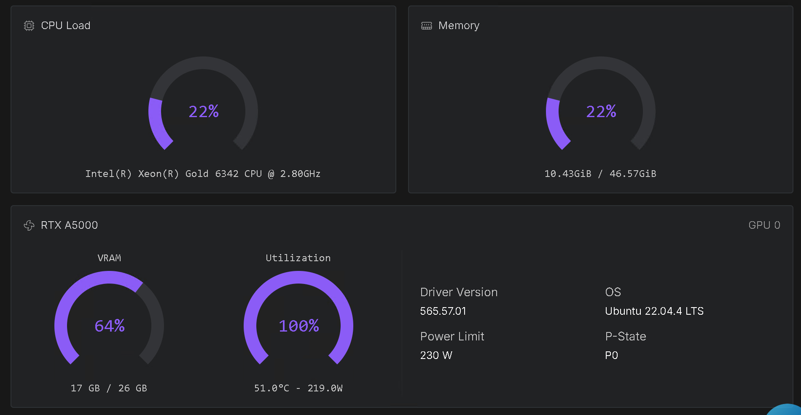
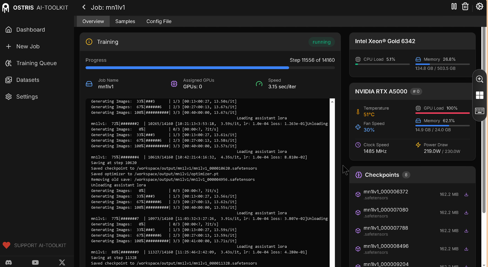
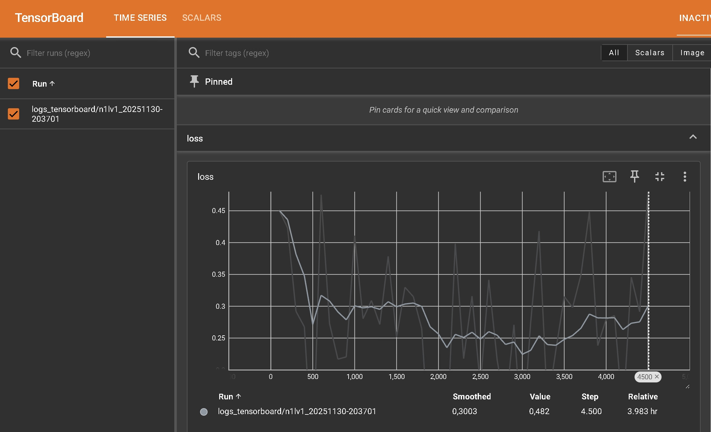

[](https://hub.docker.com/r/ls250824/run-ai-toolkit)

# run-ai-toolkit on RunPod

## Synopsis

A streamlined setup for running **Ostris AI Toolkit** 
This pod downloads models as specified in the **environment variables** set in the template

- Models are automatically downloaded based on the specified paths in the environment configuration.  
- Authentication credentials can be set via secrets for:  
  - **Code server** authentication (not possible to switch off) 
  - **Hugging Face** token for model access.  

Ensure that the required environment variables and secrets are correctly set before running the pod.
See below for options.

## Training Z-Image Turbo Lora on RunPod on RTX A5000

### Console



### UI



### Tensorboard



## Template RunPod

[**👉 AI Toolkit**](https://console.runpod.io/deploy?template=3cmazei34j&ref=se4tkc5o)

## 📚 Documentation

- [📚 Resources](docs/ai-toolkit_resources.md)
- [💻 Hardware Requirements](docs/ai-toolkit_hardware.md)
- [⚙️ Image setup](docs/ai-toolkit_image_setup.md)
- [⚙️ Environment variables](docs/ai-toolkit_configuration.md)

## Setup

## Available Images

### Image

- Base Image: ls250824/pytorch-cuda-ubuntu-develop:<[](https://hub.docker.com/r/ls250824/pytorch-cuda-ubuntu-develop)>

### Custom Build: 

```bash
docker pull ls250824/run-ai-toolkit:<version>
```

## Building the Docker Image 

You can build and push the image to Docker Hub using the `build-docker.py` script.

### `build-docker.py` script options

| Option         | Description                                         | Default                |
|----------------|-----------------------------------------------------|------------------------|
| `--username`   | Docker Hub username                                 | Current user           |
| `--tag`        | Tag to use for the image                            | Today's date           |
| `--latest`     | If specified, also tags and pushes as `latest`      | Not enabled by default |

### Build & push Command

Run the following command to clone the repository and build the image:

```bash
git clone https://github.com/jalberty2018/run-ai-toolkit.git
mv ./run-ai-toolkit/build_docker.py ..

export DOCKER_BUILDKIT=1
export COMPOSE_DOCKER_CLI_BUILD=1

python build-docker.py \
--username=<your_dockerhub_username> \
--tag=<custom_tag> \ 
run-ai-toolkit
```

Note: If you want to push the image with the latest tag, add the --latest flag at the end.
