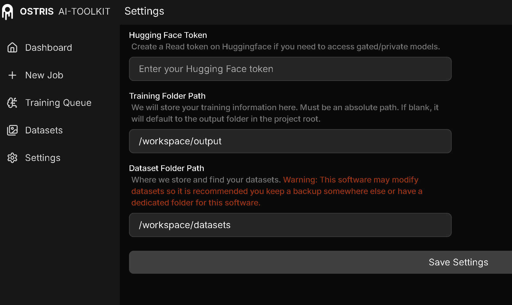
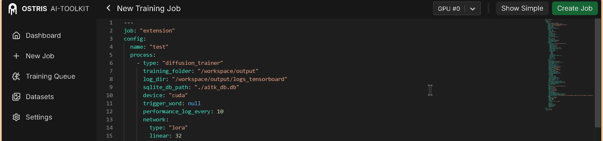

# Tutorial

## Settings

## Training example

### Z-Image Turbo

- Copy the following example to the show-advanced training tab of the AI-Toolkit UI for editing.
- [Example](config_examples/ZIT.yaml)